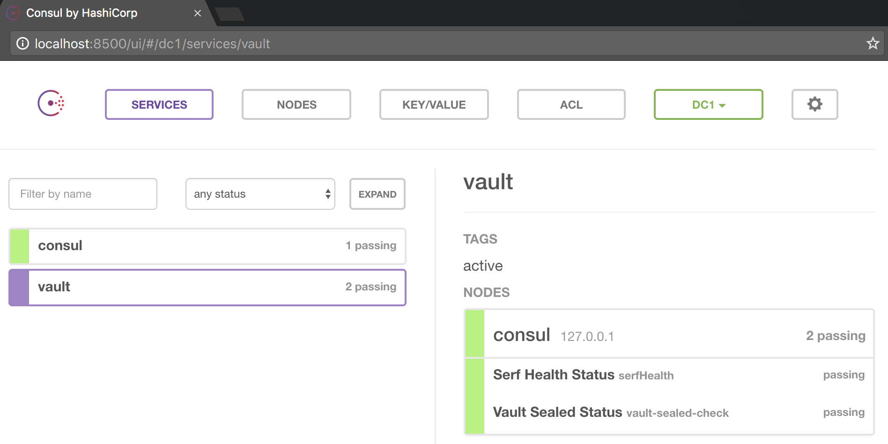
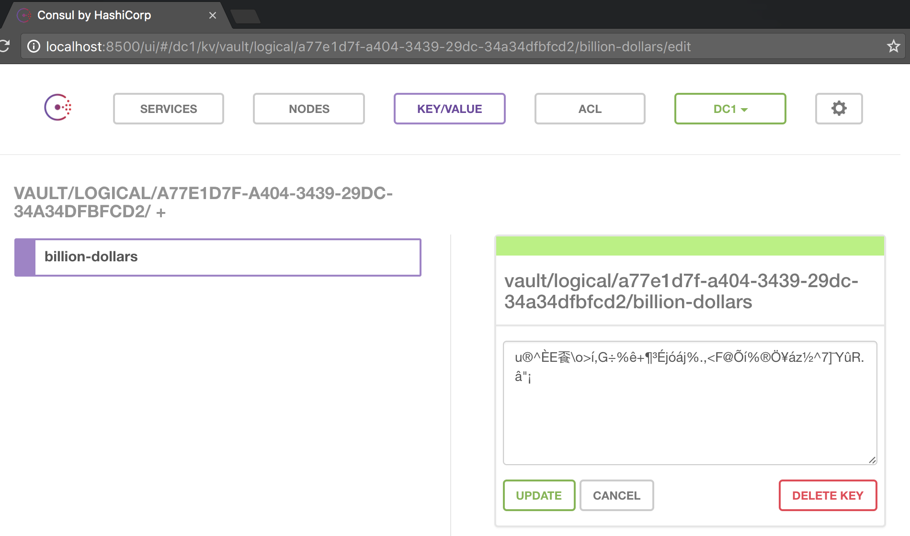
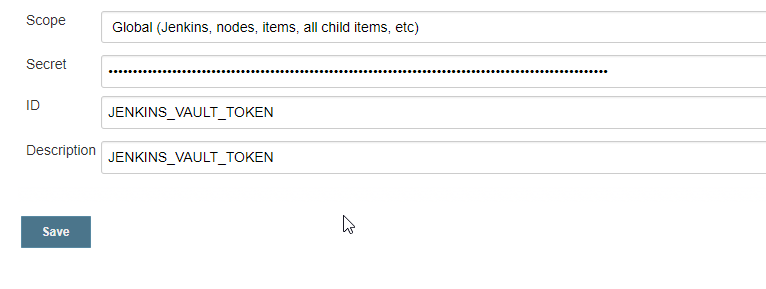
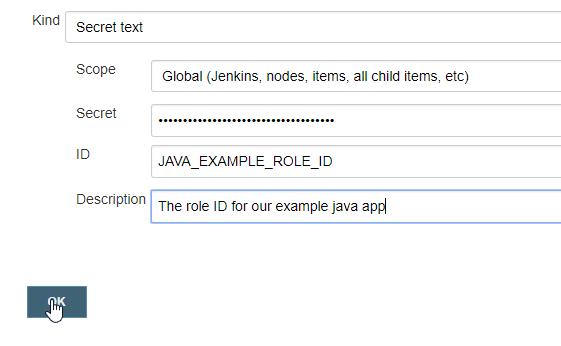
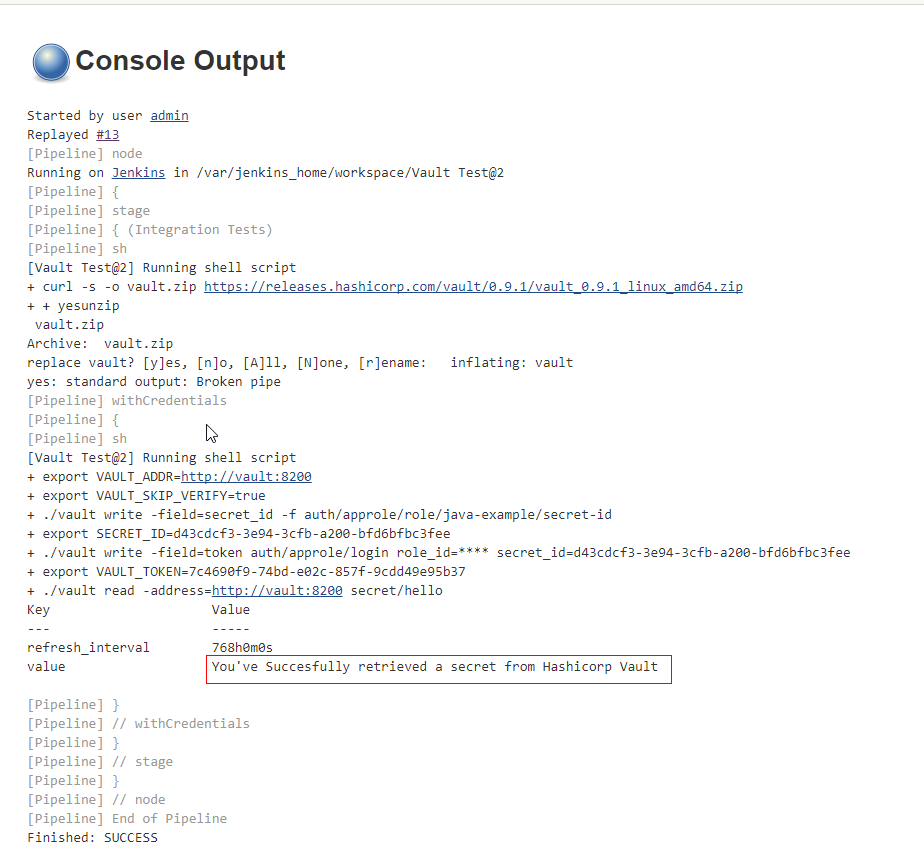

# How to use HashiCorp Vault to store secrets and read them from Jenkins

by Rodrigo A. Diaz Leven

- [How to use HashiCorp Vault to store secrets and read them from Jenkins](#how-to-use-hashicorp-vault-to-store-secrets-and-read-them-from-jenkins)
  * [Description](#description)
  * [Why do we want to use it.](#why-do-we-want-to-use-it)
  * [The setup](#the-setup)
- [Initial Vault configuration](#initial-vault-configuration)
  * [Checking Vault is unsealed](#checking-vault-is-unsealed)
  * [Testing](#testing)
- [Reading secrets from Jenkins](#reading-secrets-from-jenkins)
  * [AppRole](#approle)
  * [Generating Policies and Roles](#generating-policies-and-roles)
  * [Generating Role ID](#generating-role-id)
  * [Generating Jenkins Token ID](#generating-jenkins-token-id)
  * [Configuring Jenkins credentials to access Vault](#configuring-jenkins-credentials-to-access-vault)
  * [Reading the secret](#reading-the-secret)
  * [Retrieving secrets from source code](#retrieving-secrets-from-source-code)
  * [Job Output](#job-output)
- [Optional: Installing Vault plugin for Jenkins](#optional--installing-vault-plugin-for-jenkins)
- [References](#references)

## Description

In this article we will learn how to store secret or any other type of information you wish like Certificates in [Vault](https://www.vaultproject.io/) .

Vault works by exchanging **information** for **secrets**, for example  a client could havea RoleID and a SecretID or a temporary Token that it can trade for the actual Secret.

It also can create temporary access to a 3rd party services like AWS through the use of back ends.

## Why do we want to use it.

* Centralized secrets storage and role based access.

* Replace secrets stored in source code or shell scripts which then are stored in places, difficult to replace with one time or temporary authentication credentials.

* Create dynamic authentication for short lived jobs, ie AWS infrastructure creation. This means that a short lived set of AWS secret/key pair is created for a job and they won't need to be hard coded.

* Optional, Human authentication to services like SSH, Jenkins, VPN, etc.

## The setup

We will test this by using a docker-compose project that will orchestrate 3 containers:

* Consul: service discovery and backend for storing encrypted secrets
* Vault: Service for converting tokens to secrets
* Jenkins: Automation

We persist Jenkins configuration in a Docker volume called "jenkins-data" and bind the local directory config to the Consul container so we can copy configuration later.

```yaml
version: '2'
services:
 consul:
   image: "consul"
   hostname: "consul"
   command: "agent -dev -client 0.0.0.0"
   ports:
     - "8400:8400"
     - "8500:8500"
     - "8600:53/udp"
 vault:
   depends_on:
     - consul
   image: "vault"
   hostname: "vault"
   links:
     - "consul:consul"
   environment:
     VAULT_ADDR: http://127.0.0.1:8200
   ports:
     - "8200:8200"
   volumes:
     - ./tools/wait-for-it.sh:/wait-for-it.sh
     - ./config/vault:/config
     - ./config/vault/policies:/policies
   entrypoint: /wait-for-it.sh -t 20 -h consul -p 8500 -s -- vault server -config=/config/with-consul.hcl
 blueocean:
   depends_on:
     - vault
   image: "jenkinsci/blueocean:latest"
   ports:
     - "8080:8080"
   volumes:
     - /var/run/docker.sock:/var/run/docker.sock
     - 'jenkins-data:/var/jenkins_home'
volumes:
 jenkins-data:

```

# Initial Vault configuration

The first command starts the container and the second one logs us in the Vault container to "unseal" it.

This is the term used by Vault to say the service is ready to be used and to do so we need 3 of the 5 keys that were generated by the init command.

This is only needed the first time we setup vault and you should store the keys in a secure place.

```bash
$ docker-compose up -d
Creating vaultjenkins_consul_1 ... 
Creating vaultjenkins_consul_1 ... done
Creating vaultjenkins_vault_1 ... 
Creating vaultjenkins_vault_1 ... done
Creating vaultjenkins_blueocean_1 ... 
Creating vaultjenkins_blueocean_1 ... done

$ docker exec -it vaultjenkins_vault_1 sh

(vaultjenkins_vault_1)$ vault init
Unseal Key 1: d28dc3e20848c499749450b411bdc55416cefb0ff6ddefd01ec02088aa5c90aa01
Unseal Key 2: ad2b7e9d02d0c1cb5b98fafbc2e3ea56bd4d4fa112a0c61882c1179d6c6585f302
Unseal Key 3: c393269f177ba3d07b14dbf14e25a325205dfbf5c91769b8e55bf91aff693ce603
Unseal Key 4: 87c605e5f766d2f76d39756b486cbdafbb1998e72d2f766c40911f1a288e53a404
Unseal Key 5: e97e5de7e2cdb0ec4db55461c4aaf4dc26092cb3f698d9cc270bf19dbb82eab105
Initial Root Token: 5a4a7e11-1e2f-6f76-170e-b8ec58cd2da5

(vaultjenkins_vault_1)$ vault unseal (run this 3 times with 3 different keys from above)

```

## Checking Vault is unsealed

If the unseal was successful then you can login to the UI by going to:

[http://localhost:8500/ui/#/dc1/services/vault](http://localhost:8500/ui/#/dc1/services/vault)



## Testing

The first command sets an alias so we dont have to keep typing the same thing over and over.

We will use the Vault client from inside the container but you can use one installed in your local machine too.

```bash
$ alias vault='docker exec -it vaultjenkins_vault_1 vault "$@"'

$ vault write -address=http://127.0.0.1:8200 secret/billion-dollars value=behind-super-secret-password

$ vault read secret/billion-dollars
Key             	Value
---             	-----
refresh_interval	2592000
value           	behind-super-secret-password
```


Here we store a secret text "behind-super-secret-password" in the path "secret/billion-dollars" and check in the UI if it was recorded encrypted.




# Reading secrets from Jenkins

## AppRole

AppRole is a secure introduction method to establish machine identity. 

In AppRole, in order for the application to get a token, it would need to login using a Role ID (which is **static**, and associated with a policy), and a Secret ID  (which is **dynamic**, one time use, and can only be requested by a previously authenticated user/system. In this case, we have two options:

* Store the Role IDs in Jenkins

* Store the Role ID in the Jenkinsfile of each project

## Generating Policies and Roles

Now Jenkins will need permissions to retrieve Secret IDs for our newly created role. Jenkins shouldn’t be able to access the secret itself, list other Secret IDs, or even the Role ID.

In this case, tokens assigned to the **java-example** policy would have permission to read a secret on the **secret/hello** path.

```bash
$ echo 'path "auth/approle/role/java-example/secret-id" {
  capabilities = ["read","create","update"]
}' > ./config/vault/policies/jenkins_policy.hcl

$ vault policy-write jenkins ./config/vault/policies/jenkins_policy.hcl

```


Now we have to create a **Role **that will generate **tokens **associated with that **policy**, and retrieve the token:

```bash
$ echo 'path "secret/hello" {
  capabilities = ["read", "list"]
}' > ./config/vault/policies/java-example_policy.hcl
$ vault policy-write java-example ./config/vault/policies/java-example_policy.hcl

Policy 'java-example' written.
```
```bash
$ vault auth-enable approle
$ vault write auth/approle/role/java-example \
> secret_id_ttl=60m \
> token_ttl=60m \
> token_max_tll=120m \
> policies="java-example"
Success! Data written to: auth/approle/role/java-example

$ vault read auth/approle/role/java-example
Key                 Value
---                 -----
bind_secret_id      true
bound_cidr_list
period              0
policies            [default java-example]
secret_id_num_uses  0
secret_id_ttl       3600
token_max_ttl       0
token_num_uses      0
token_ttl           3600

```


## Generating Role ID

We generate a **Role ID** for our application that can be used in conjunction with the Jenkins **Token ID** to generate a **Secret ID** that will allow us to access the secret at the path "secret/hello" per our policy.

```bash
$ vault read auth/approle/role/java-example/role-id
Key    	Value
---    	-----
role_id	73ea4552-53da-6844-bab0-0d39d2dc06aa
```

## Generating Jenkins Token ID

Jenkins needs a long lived token but it needs to be eventually rotated.

```bash
$ vault token-create -policy=jenkins
Key            	Value
---            	-----
token          	c70b74af-0e46-40da-ae15-c09b95a636f9
token_accessor 	1c1ad1bf-1b56-e398-169a-7e14600a3cb3
token_duration 	768h0m0s
token_renewable	true
token_policies 	[default jenkins]
```

## Configuring Jenkins credentials to access Vault

This is the long lived Token ID we generated for Jenkins use.



This is the Role ID for our example app and is restricted to "secret/hello" by our policy, it can also be hardcoded in the source code or job script.



## Reading the secret

Let’s write a secret that our application will consume:

    $ vault write secret/hello value="You've Successfully retrieved a secret from Hashicorp Vault"
    Success! Data written to: secret/hello

We are going to exchange **ROLE_ID **(belonging only to this particular job) and a temporary **SECRET_ID **(generated with the Jenkins token) for another **SECRET_ID**.

This second **SECRET_ID** has a policy attached that will only let us access the secrets at the path "secret/hello".

This way we can authenticate our jobs and assign them specific access to our secrets, without leaving any secrets in our our source code or shell scripts.


```groovy
pipeline {
  agent any
stages {  
  stage('Integration Tests') {
      steps {
      sh 'curl -s -o vault.zip https://releases.hashicorp.com/vault/0.9.1/vault_0.9.1_linux_amd64.zip ; yes | unzip vault.zip '
        withCredentials([string(credentialsId: 'JAVA_EXAMPLE_ROLE_ID', variable: 'ROLE_ID'),string(credentialsId: 'JENKINS_VAULT_TOKEN', variable: 'VAULT_TOKEN')]) {
        sh '''
  set +x
  export VAULT_ADDR=http://vault:8200
  export VAULT_SKIP_VERIFY=true
  export SECRET_ID=$(./vault write -field=secret_id -f auth/approle/role/java-example/secret-id)
  export JOB_VAULT_TOKEN=$(./vault write -field=token auth/approle/login role_id=${ROLE_ID}   secret_id=${SECRET_ID})
./vault read -address=http://vault:8200 secret/hello 
        '''
    }
   }
  }
 }
}
```


* We retrieve a **SECRET_ID **A using Jenkins administrative **JENKINS_VAULT_TOKEN **(that we’ve manually generated before). That’s the only one that would be relatively longed lived, but can only generate SECRET_IDs. Notice that we store this SECRET_ID A in the environment variable called VAULT_TOKEN so the vault client can use it.

    * ```
      ./vault write -field=secret_id -f auth/approle/role/java-example/secret-id
      ```

      ​

* We do an AppRole login with the **ROLE_ID **and the **SECRET_ID A **(short lived), this gives us a second **SECRET_ID B** that we store in the environment variable VAULT_TOKEN:

    * ```
      ./vault write -field=token auth/approle/login role_id=${ROLE_ID} secret_id=${SECRET_ID}
      ```

* We use this **SECRET_ID B** to read our plain text secret:

    * ```
      ./vault read -address=http://vault:8200 secret/hello 
      ```

      ​

## Retrieving secrets from source code

We can also retrieve the secrets from an application at run time, using environment variables to authenticate to Vault like this:

```java
<td>  String vaulttoken = System.getenv("VAULT_TOKEN");
    String vaulthost = System.getenv("VAULT_ADDR");
    System.out.format( "Using Vault Host %s\n", vaulthost);
    System.out.format( "With Vault Token %s\n", vaulttoken );
    /* This should be a separate method called from Main, then
     * again for simplicity...
     */
    final VaultConfig config = new VaultConfig().build();
    final Vault vault = new Vault(config);
    try {
    final String value = vault.logical()
                   .read("secret/hello")
                   .getData().get("value");
    System.out.format( "value key in secret/hello is " + value +"\n");
    } catch(VaultException e) {
      System.out.println("Exception thrown: " + e);
    }
```

## Job Output



# Optional: Installing Vault plugin for Jenkins

More information: [https://github.com/jenkinsci/hashicorp-vault-plugin](https://github.com/jenkinsci/hashicorp-vault-plugin)


If we decide to use this plugin then we will be using the "[Response Wrapping](https://www.vaultproject.io/docs/concepts/response-wrapping.html)" feature from vault.

This feature creates one time use tokens that are used to access specific secrets and limiting the time they can be used.

```groovy
node {
  // define the secrets and the env variables
  def secrets = [
      [$class: 'VaultSecret', path: 'secret/testing', secretValues: [
          [$class: 'VaultSecretValue', envVar: 'testing', vaultKey: 'value_one'],
          [$class: 'VaultSecretValue', envVar: 'testing_again', vaultKey: 'value_two']]],
      [$class: 'VaultSecret', path: 'secret/another_test', secretValues: [
          [$class: 'VaultSecretValue', envVar: 'another_test', vaultKey: 'value']]]
  ]

  // optional configuration, if you do not provide this the next higher configuration
  // (e.g. folder or global) will be used
  def configuration = [$class: 'VaultConfiguration',
                       vaultUrl: 'http://my-very-other-vault-url.com',
                       vaultCredentialId: 'my-vault-cred-id']

  // inside this block your credentials will be available as env variables
  wrap([$class: 'VaultBuildWrapper', configuration: configuration, vaultSecrets: secrets]) {
      sh 'echo $testing'
      sh 'echo $testing_again'
      sh 'echo $another_test'
  }
}
```

# References

A lot of information for this article was used from:

- http://nicolas.corrarello.com/general/vault/security/ci/2017/04/23/Reading-Vault-Secrets-in-your-Jenkins-pipeline.html 

The Docker compose project was based on:

- https://github.com/tolitius/cault

  ​